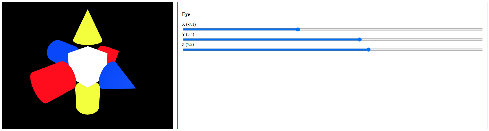

# Compass 3D

## Simple WebGL application made on Typescript

The application renders an oriented graphical primitives:
* The cube is located in the global origin;
* Cilinders mark negative axe directions:
  * Red - (-X);
  * Yellow - (-Y);
  * Blue - (-Z);
* Cones point to positive axe directions:
  * Red - (+X);
  * Yellow - (+Y);
  * Blue - (+Z).



## Dependencies

- NodeJS;
- Npm;
- Web browser with WebGL 1.0 support.

## Running & Development

```
npm install
npm run start
```

Develompent server is run on 8080 port (http://localhost:8080)

## Implementation

The application is fully implemented on Typescript.

- [src/scenes/compass/compass-scene.ts](src/scenes/compass/compass-scene.ts) - rendering the model into GL context;
- [src/scenes/compass/compass-load-model.ts](src/scenes/compass/compass-load-model.ts) - loading the model from GLB file;
- [scr/core/gl-context.ts](src/core/gl-context.ts) - getting GL context having html selector of `canvas` element;
- [scr/core/gl-matrix.ts](src/core/gl-matrix.ts) - 4*4 matrix mathematics;
- [scr/core/gl-matrix.ts](src/core/gl-vector.ts) - 3 dimentional vector mathematics;
- [scr/core/gl-shader.ts](src/core/gl-shader.ts) - initialization of shader programs;
- [scr/tools/angles.ts](src/tools/angles.ts) - transformation angles from degrees to radians.

## License

This repository and the code inside it is licensed under the MIT License. Read [LICENSE](LICENSE) for more information.
